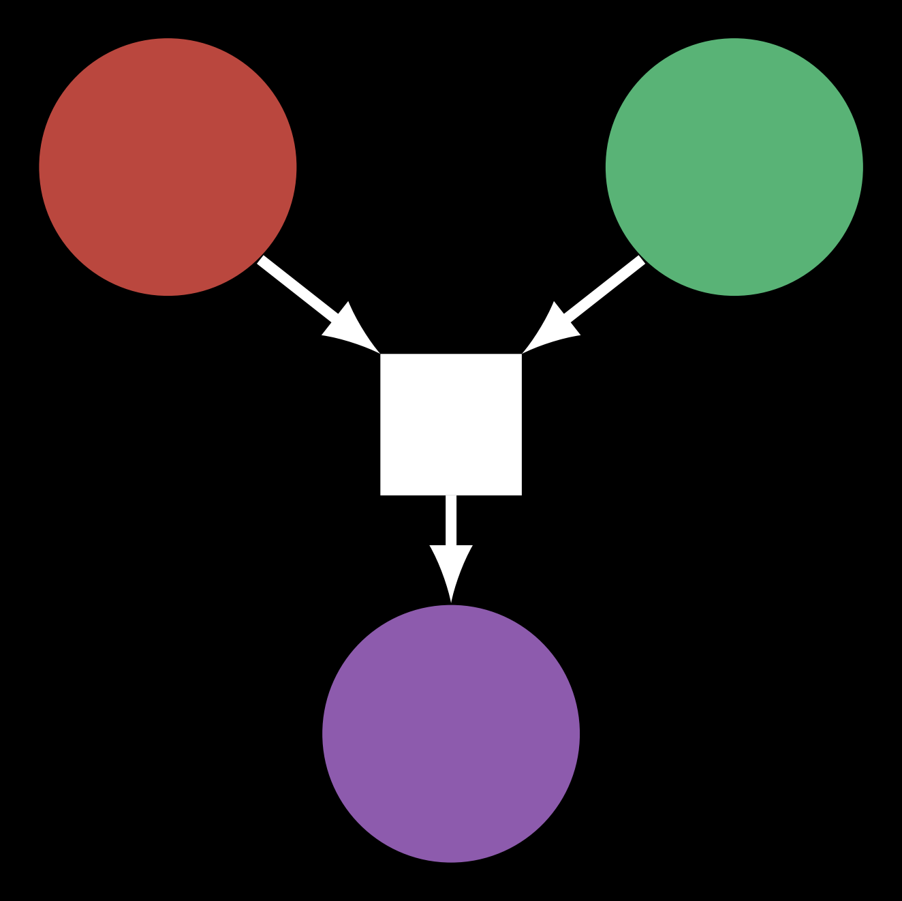

<div style="text-align: center;">
  
</div>

<br>

`JuLS` is a Julia Local Search solver that combines Constraint Based Local Search (CBLS) and Constraint Programming (CP) to solve Constraint Optimization Problem (COP). It is to be seen as an open source project that gives the possibility to solve combinatorial and black box optimization problem.

A paper with theoritical foundations accompanying this solver can be found [here](JuLS.pdf). 

The CBLS part is inspired from the paper [LocalSolver 1.x](https://www.afpc-asso.org/assets/actes/actes-JFPC-2011.pdf#page=37). The CP part is inspired from [MiniCP](http://www.minicp.org/) and [SeaPearl.jl](https://github.com/corail-research/SeaPearl.jl). 

---

## Installation

Clone the project and start julia in your terminal at the root using :
```
julia --threads=auto --project=.
```
---

## Use

Examples are given for the Knapsack problem, TSP and Graph Coloring Problem in this [notebook](zoo.ipynb) . To solve a new COP using JuLS, one needs to : 
1. Create a new experiment to store the instance data : 
```julia
YourExperiment <: Experiment
```
An experiment must implement the functions :
```julia
n_decision_variables(e::YourExperiment)
decision_type(e::YourExperiment)
```
These functions define the number of decision variables and the type of decision (`BinaryDecisionValue`, `IntDecisionValue`, ...)

2. Declare the domain generation function for your decision variables
```julia
generate_domains(e::YourExperiment)
```

3. Declare an initialization heuristic that must return a vector of decision variables : 
```julia
(::SimpleInitialization)(e::YourExperiment)
```

4. Create a Directed Acyclic Graph (DAG) of invariants representing your COP : 
```julia
create_dag(e::YourExperiment)
```
5. Declare a neighbourhood heuristic
```julia
struct YourNeighbourhood <: NeighbourhoodHeuristic
```
Otherwise a default neighbourhood heuristic is given automatically. This one samples randomly two decision variables and generates all the possible move combinations for these variables.

6. Declare a move selection heuristic
```julia
struct YourPicker <: MoveSelectionHeuristic
```
Otherwise a default move selection heuristic is given automatically. This one picks the most impactful and feasible move among the ones evaluated. 

7. Initialize a model. To efficiently filter moves with CP, set `using_cp = true`
```julia
model = init_model(
    e; 
    init = SimpleInitialization(),
    neigh = YourNeighbourhood(...), 
    pick = YourPicker(...),
    using_cp = true
)
```

8. Optimize over iterations or time
```julia
optimize!(model; limit = IterationLimit(100))
optimize!(model; limit = TimeLimit(10))
```

9. Generate an output 
```julia
make_output_folder(model)
```
---

## Wrapper for JuLS solver

- [model](src/model/model.jl): The Local Search model that will optimize the problem defined
- [dag](src/dag/dag.jl): The Directed Acyclic Graph (DAG) structure to evaluate the constraints and objectives of the problem to optimize. Each DAG component is declared in the invariant section.
- [cp](src/cp/cp.jl): The constraint programming solver to filter efficiently infeasible moves. A builder is provided to convert a DAG into the corresponding CSP (Constraint Satisfaction Problem)
- [heuristics](src/heuristics/heuristics.jl): The heuristics to be used during model optimization for initialization, neighbourhood definition and move selection.
- [experiments](src/experiments/experiments.jl): Optimizes a certain problem based on input data. The place to declare the problem's DAG and the customized heuristics.

---

## Bugs or questions?
If you have any inquiries pertaining to the code or the paper, please do not hesitate to contact the authors cited below. In case you encounter any issues while utilising the code or wish to report a bug, you may open an issue. We kindly request that you provide specific details regarding the problem so that we can offer prompt and efficient assistance.

---

## Authors

- [**Axel Navarro**](https://www.linkedin.com/in/axel-navarro-99289921a/)
- [**Arthur Dupuis**](https://www.linkedin.com/in/arthur-dupuis-3a38301a5/)
- [**Ilan Coulon**](https://www.linkedin.com/in/ilancoulon/)
- [**Ezra Reich**](https://www.linkedin.com/in/ezra-reich/)
- [**Mehdi Oudaoud**](linkedin.com/in/el-mehdi-oudaoud-7830b9201/)
- [**Maxime Mulamba**](https://www.linkedin.com/in/maxime-mulamba-ke-tchomba-b17145195/)

---
